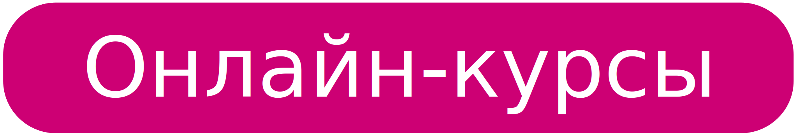
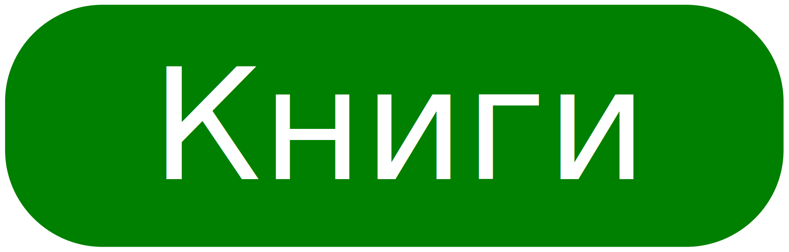

# Моё развитие

* HTML Academy - Интерактивные курсы
* LoftBlog - «Основы JavaScript».
* Хекслет - "Жизнь программиста"

* Онлайн-учебник - Learn.javascript.ru
* "Изучаем программирование на JavaScript" - Эрик Фримен, Элизабет Робсон
* "Код. Такйный язык информатики" - Чарльз Петцольд
